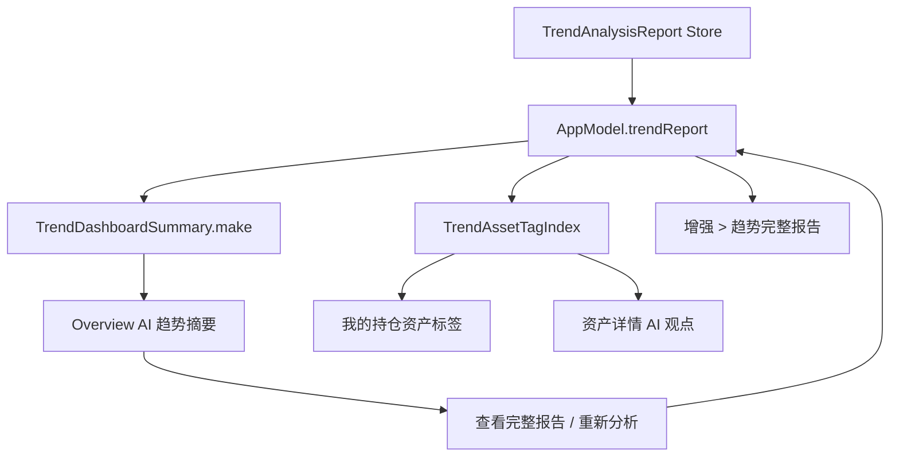

# AI 趋势分析在总览与我的持仓中的体现设计

## 背景

当前应用已经具备 AI 趋势分析能力：`TrendAnalysisReport` 保存组合结论、风险等级、短中长期判断、板块观点、重点标的、行动候选、证据和提示；「增强 > 趋势」展示完整报告；「我的持仓」的资产浏览器已经能接收 `trendReport` 并生成资产级标签。

本设计目标不是新增一套 AI 分析能力，而是把同一份 `TrendAnalysisReport` 以更轻、更高频的方式体现在用户最常看的「总览」和「我的持仓」中。

## 目标

- 总览页直接回答“当前组合怎么看”：一句结论、风险等级、短中长期判断、板块观点。
- 我的持仓页回答“每个标的怎么理解”：资产级趋势标签、动作建议、触发条件、反证条件。
- 增强页继续承载完整报告、生成过程、证据来源和边界提示。
- 保持业务计算在 Core 层，SwiftUI 只消费展示模型。
- 复用现有 `TrendAnalysisReport`、`TrendAssetTagIndex`、`generateTrendAnalysis` 和 `enhancementTrendStatus`。

## 非目标

- 不新增新的模型供应商配置入口。
- 不把完整 AI 报告复制到总览页。
- 不把 AI 结论写入持仓原始数据。
- 不把 AI 输出表达为确定性投资建议；所有动作保持“候选、观察、复核、条件触发”的语气。

## 推荐方案

采用三层表达：

1. 「总览」展示组合级 AI 趋势摘要。
2. 「我的持仓」展示标的级 AI 标签和详情。
3. 「增强 > 趋势」展示完整报告和生成控制。

这样可以让总览保持高信噪比，让持仓页保留资产操作语境，也避免和增强中心重复。

## 总览页设计

新增 `AI 趋势摘要` 区块，建议放在 `TodayBriefPanel` 之后、`DashboardInsightPanel` 之前。这个位置接近今日简报，用户可以先看当天事项，再看 AI 对组合趋势的判断。

区块内容：

- 顶部：`report.portfolio.headline` 作为一句结论。
- 右侧：`report.portfolio.riskLevel` 风险等级 badge。
- 辅助信息：`report.dataAsOf`、`report.externalSignalStatus`、`report.generatedAt`。
- 短中长期：从 `report.horizons` 中取 short、medium、long 三个周期，每个周期展示方向、信心、最多两行理由。
- 板块观点：从 `report.sectors` 中取前 3 到 4 个板块，每个展示板块名、方向、敞口、最多两行理由。
- 操作：`查看完整报告` 跳转到「增强 > 趋势」；`重新分析` 调用现有 `generateTrendAnalysis(userInitiated: true)`。

展示状态：

- 未配置模型：显示“尚未配置趋势分析模型”，主操作跳转「设置 > 趋势」。
- 已配置但未生成：显示“等待生成 AI 趋势分析”，主操作为“立即分析”。
- 生成中：显示生成中状态和最近一条进度日志，禁用重复生成。
- 已生成且当天有效：展示摘要。
- 已生成但过期：展示摘要，同时显示“待更新”提示，主操作为“重新分析”。
- 失败或被拦截：展示错误摘要，主操作为“重新分析”，次操作为“查看完整报告”。

视觉约定：

- 使用现有 `SectionCard`、`AppPalette`、`ViewThatFits`、`LazyVGrid`。
- 风险等级颜色使用语义映射：低风险 `positive`，中风险 `warning`，高风险 `error`，未知 `muted`。
- 涨跌或趋势方向仍遵循中国市场习惯和 `AppPalette.marketTint` 的约定，不在组件中硬编码红绿。
- 所有长文本最多两到三行，完整内容进入增强页或资产详情。

## 我的持仓页设计

我的持仓页不重复组合级摘要，重点体现资产级 AI 影响。

资产表行：

- 继续使用 `TrendAssetTagIndex(report: trendReport)` 为每行资产生成 `TrendAssetTagSummary`。
- 强化标签优先级：板块、动作、短期方向、信心、反证条数。
- 没有标的级覆盖时，允许使用板块级 fallback，但标签要显示“待补齐”或“板块视角”，避免误导成单只资产结论。

资产详情抽屉：

- 新增或强化 `AI 观点` 小节。
- 展示资产影响说明 `impactText`。
- 展示 AI 理由 `rationale`。
- 展示动作候选 `tradePlan`。
- 展示触发条件和反证条件。
- 展示数据时点 `dataAsOf` 和生成时间 `generatedAt`。

持仓页顶部可选轻提示：

- 若 AI 报告存在但过期，在分析面板附近显示一条轻提示：“AI 趋势报告待更新”。
- 不建议在持仓页顶部再放完整组合摘要，避免和总览重复。

## 增强页关系

「增强 > 趋势」保持完整报告展示和生成入口，是深读页面。

从总览跳转到增强页时，应设置：

- `model.selectedSection = .enhancement`
- `model.selectedEnhancementTab = .trend`

如果当前枚举或路由尚未提供 `.trend` 目标，则实现时补齐跳转能力，不改变增强页作为完整报告宿主的定位。

## Core 展示模型

新增一个纯派生展示模型，建议文件名为 `Core/TrendDashboardSummary.swift`。

核心结构：

```swift
struct TrendDashboardSummary: Hashable {
    let status: TrendDashboardStatus
    let headline: String
    let riskLevel: TrendRiskLevel?
    let riskText: String
    let generatedAt: String?
    let dataAsOf: String?
    let externalSignalText: String?
    let horizons: [TrendDashboardHorizonItem]
    let sectors: [TrendDashboardSectorItem]
    let primaryAction: TrendDashboardAction
    let secondaryAction: TrendDashboardAction?
}
```

职责：

- 从 `TrendAnalysisReport?`、`EnhancementTrendStatus`、`TrendGenerationState`、`lastTrendError` 派生总览展示数据。
- 控制文本截断、空态文案、过期状态和主操作类型。
- 不直接发起网络请求，不持久化，不修改 `TrendAnalysisReport`。

`AppModel` 提供只读计算属性：

```swift
var trendDashboardSummary: TrendDashboardSummary {
    TrendDashboardSummary.make(
        report: trendReport,
        trendStatus: enhancementTrendStatus,
        generationState: trendGenerationState,
        lastError: lastTrendError
    )
}
```

## 数据流



## 错误处理

- 模型未配置：不显示错误堆栈，引导到设置。
- 报告为空：显示等待生成，不伪造趋势结论。
- 报告过期：仍可展示旧报告，但明确标记“待更新”。
- 生成失败：展示 `lastTrendError` 的简短版本，完整进度仍在增强页。
- 报告被校验拦截：展示“报告未通过安全校验”，避免使用不完整 JSON。
- 板块或周期缺失：对应位置显示“暂无判断”，而不是隐藏整个区块。

## 测试策略

新增或扩展 XCTest：

- `TrendDashboardSummaryTests`
  - 未配置模型时生成配置入口。
  - 已配置未生成时生成立即分析入口。
  - 已生成报告时包含一句结论、风险等级、短中长期、板块观点。
  - 过期报告标记待更新。
  - 失败和 rejected 状态展示可恢复动作。
- `PersonalAssetBrowserPresentationTests`
  - 资产行优先展示标的级 AI 标签。
  - 无标的级覆盖时使用板块 fallback 并显示覆盖提示。
- 现有趋势分析 store、validator、prompt tests 保持不变。

人工验证：

- 未配置、未生成、生成中、成功、过期、失败六种状态在总览页不出现空白或重叠。
- 总览页窄窗口下三周期卡片和板块观点能换行。
- 持仓表有 AI 标签时行高稳定，横向滚动仍可用。

## 实施切分

1. 新增 `TrendDashboardSummary` 纯展示模型和单元测试。
2. 在 `AppModel` 暴露 `trendDashboardSummary`。
3. 在 `OverviewSectionView` 新增 `AITrendSummaryPanel`。
4. 将总览操作接入跳转增强页、重新分析、配置趋势模型。
5. 强化资产详情抽屉中的 `AI 观点` 展示。
6. 补充持仓页和总览页状态验证。

## 验收标准

- 总览页能看到一句 AI 结论、风险等级、短中长期判断、板块观点。
- 我的持仓页资产行或资产详情能看到资产级 AI 影响。
- 点击“查看完整报告”能进入增强页趋势报告。
- 点击“重新分析”复用现有趋势分析生成流程。
- AI 报告为空、过期、生成失败时都有清晰状态，不误导用户。
- `swift test` 通过。
