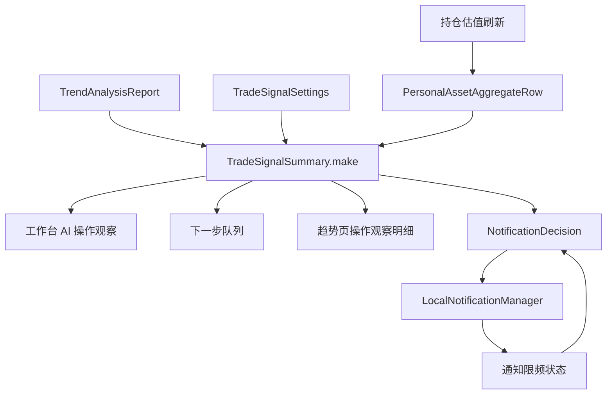

# AI 操作观察与及时提醒设计

## 背景

当前应用已经具备趋势分析链路：`TrendAnalysisReport` 保存组合判断、短中长期趋势、板块观点、标的观点、行动候选、证据、反证条件和免责声明；「工作台 > 趋势」展示完整报告；`EnhancementDashboardSummary` 会把趋势状态和提醒队列汇总到工作台。

本设计在现有趋势分析上补一层更贴近日常使用的闭环：AI 给出操作观察，今日持仓数据刷新后继续追踪这些观察条件，并在有新信号或信号变化时及时提醒用户。

用户确认的产品方向：

- 展示采用“工作台优先”：打开工作台先看到 AI 操作观察摘要，趋势页保留完整依据。
- 分析采用“AI 主动判断 + 全局/单标的偏好”：不做固定涨跌幅触发器。
- 通知采用“最近一次 AI 分析 + 今天数据变化”：即使报告不是当天生成，也可继续追踪，但必须标注基于上次 AI 分析。

## 目标

- 在工作台首屏展示 AI 操作观察摘要，优先显示今天触发或升级的信号。
- 在趋势页展示完整依据，包括单标的判断、触发条件、失效条件、反证条件和偏好影响。
- 在持仓估值刷新后，将今日数据变化与 AI 报告中的条件式判断做匹配。
- 命中“新信号、信号升级、触发条件、失效条件、反向变化”时，生成 App 内提醒和可选 macOS 本地通知。
- 保持投资建议语气克制：只使用“关注、可考虑、等待确认、复核”等条件式表达。
- 将业务计算放在 Core 层，SwiftUI 只消费展示模型。

## 非目标

- 不自动下单。
- 不生成强制买入金额或强制卖出金额。
- 不把 AI 结论写回用户持仓原始数据。
- 不用固定涨跌幅替代 AI 判断。
- 不把过期 AI 报告伪装成今日新分析。
- 不承诺收益，不使用“必须买入、必须卖出、一定上涨”等确定性措辞。

## 推荐体验

采用两层展示：

1. 工作台首屏：`AI 操作观察` 摘要，显示 Top 信号和今日触发状态。
2. 趋势页：完整 `TrendAnalysisReport`，显示所有依据、条件、反证、证据和免责声明。

工作台摘要示例：

- `关注买入 · 中证红利低波 · 置信 78`
- `触发：继续回撤且量能缩小`
- `失效：红利板块跌破趋势支撑`
- `基于上次 AI 分析：2026-07-03 15:00`

本地通知示例：

- 标题：`AI 操作观察：恒生科技接近关注买入条件`
- 内容：`今日涨跌与趋势条件接近，建议打开工作台复核。基于上次 AI 分析。`

## 展示设计

### 工作台首屏

在「工作台」现有状态卡和复盘区附近增加 `AI 操作观察` 模块。用户选择了工作台优先，因此此模块应作为日常入口，而不是只隐藏在趋势页。

模块内容：

- 顶部摘要：今日触发数、关注买入数、关注卖出数、等待确认数。
- 数据时点：今日行情数据时间、AI 报告生成时间。
- 过期提示：若 AI 报告不是今天生成，显示“基于上次 AI 分析”。
- Top 信号卡：最多展示 3 到 5 条，按严重性、置信度、触发状态排序。
- 主操作：`查看完整依据` 跳转「工作台 > 趋势」。
- 次操作：`重新分析` 调用现有 `generateTrendAnalysis(userInitiated: true)`。

信号卡字段：

- 标的名称和代码。
- 动作：关注买入、持有观察、关注卖出、等待确认、再平衡复核。
- 状态：新信号、接近触发、已触发、已失效、信号升级、建议重新分析。
- 置信度：来自 AI 报告或派生模型。
- 一句话理由。
- 触发条件和失效条件的命中摘要。

颜色约定：

- 买入关注使用 `AppPalette.marketGain` 语义色，以适配中国市场红涨绿跌。
- 卖出关注使用 `AppPalette.marketLoss` 语义色。
- 等待确认和持有观察使用 `AppPalette.info` 或 `AppPalette.muted`。
- 风险或失效使用 `AppPalette.warning` 或 `AppPalette.danger`。

### 趋势页

趋势页继续承载完整报告，并新增或强化“操作观察明细”区域。

明细内容：

- 所有 AI 操作观察项。
- 每个标的的完整理由、触发条件、失效条件、反证条件。
- 全局偏好和单标的偏好如何影响提示词。
- 报告生成时间、数据时点、外部信号状态。
- 免责声明和安全边界。

趋势页不是高频提醒入口，而是“为什么这么提醒”的解释页面。

### 下一步队列

`EnhancementDashboardSummary` 的 action queue 纳入 AI 操作观察：

- 今天新触发和升级的信号排在普通摘要前。
- 已失效的信号提示“重新分析”或“复核条件”。
- 同一标的同一类信号当天只出现一条，避免列表刷屏。

## 设置设计

新增 AI 操作观察偏好，归入现有趋势设置区域，避免创建新的顶层设置模块。

全局偏好：

- `enabled`: 是否启用 AI 操作观察。
- `localNotificationsEnabled`: 是否启用 macOS 本地通知。
- `riskPreference`: 保守、均衡、积极。
- `primaryHorizon`: 短期、中期、长期。
- `minimumConfidence`: 进入提醒队列的最低置信度。
- `allowBuySignals`: 是否允许关注买入。
- `allowSellSignals`: 是否允许关注卖出。
- `staleReportPolicy`: 允许使用最近一次报告继续提醒，但标注“基于上次 AI 分析”。

单标的偏好：

- `assetKey`: 与 `PersonalAssetAggregateRow.key` 对齐。
- `mode`: 跟随全局、提高关注、降低关注、仅持有观察、忽略提醒。
- `preferredHorizon`: 可选覆盖周期。
- `notes`: 可选用户备注，仅本地保存。

偏好只影响 AI 提示词、信号筛选和展示优先级，不直接触发买卖。

## Core 模型设计

新增纯派生模型，建议文件名为 `Core/TradeSignalSummary.swift`。

核心结构：

```swift
enum TradeSignalAction: String, Codable, Hashable {
    case watchBuy
    case holdObserve
    case watchSell
    case waitForConfirmation
    case rebalanceReview
}

enum TradeSignalStatus: String, Codable, Hashable {
    case new
    case approaching
    case triggered
    case invalidated
    case upgraded
    case staleAnalysis
}

struct TradeSignalItem: Identifiable, Hashable {
    let id: String
    let assetKey: String?
    let assetName: String
    let assetCode: String?
    let action: TradeSignalAction
    let status: TradeSignalStatus
    let confidence: TrendConfidence
    let title: String
    let reason: String
    let triggerSummary: String
    let invalidatingSummary: String
    let dataAsOf: String
    let analysisGeneratedAt: String
    let isBasedOnStaleAnalysis: Bool
    let priority: Int
}

struct TradeSignalSummary: Hashable {
    let headline: String
    let generatedAt: String?
    let dataAsOf: String?
    let triggeredCount: Int
    let staleAnalysis: Bool
    let items: [TradeSignalItem]
}
```

职责：

- 从 `TrendAnalysisReport?`、`personalAssetRows`、用户偏好和最近通知状态派生信号列表。
- 复用 `report.actions`、`report.assetTrends`、`report.keyAssets`。
- 将 AI 动作类型映射为更适合用户扫读的 `TradeSignalAction`。
- 根据今日数据变化判断接近触发、已触发、已失效或建议重新分析。
- 不发起网络请求，不直接写通知状态。

## 偏好持久化

新增 `TradeSignalSettings` 和 `TradeSignalSettingsStore`，使用 JSON 文件保存到数据目录。

建议路径：

- `trade-signal-settings.json`
- `trade-signal-notification-state.json`

设置文件保存偏好；通知状态文件保存当天已通知过的信号 key，用于限频。

`AppModel` 暴露：

```swift
var tradeSignalSummary: TradeSignalSummary { ... }
func updateTradeSignalSettings(_ update: (inout TradeSignalSettings) -> Void)
func markTradeSignalNotified(_ item: TradeSignalItem)
```

## 今日数据变化

今日数据变化来自现有持仓刷新结果和 `PersonalAssetAggregateRow`：

- `estimateChangePct`
- `estimateChangeAmount`
- `profitPct`
- `profitAmount`
- `marketValue`
- `effectiveHoldingAmount`
- `activePlanCount`
- `pendingTradeCount`

第一版不需要新增行情抓取接口。若后续要判断“量能、均线、支撑位”等技术条件，应通过 AI 报告中的文字条件和外部信号描述表达，不在本地硬编码技术指标。

变化判断原则：

- 若 AI 条件能明确映射到本地字段，则本地判断状态。
- 若条件无法结构化匹配，则保留为“等待确认”，不制造触发。
- 若今日走势与 AI 方向明显相反，则生成“建议重新分析”或“失效复核”。

## 通知设计

使用现有 `LocalNotificationManager` 作为 macOS 本地通知入口。

触发时机：

- 持仓估值刷新完成后。
- 趋势分析报告新生成后。
- App 启动并加载到今日数据和历史 AI 报告后。

通知条件：

- AI 操作观察已启用。
- 本地通知已启用。
- 信号达到最低置信度。
- 信号状态为新信号、接近触发、已触发、已失效或升级。
- 同一标的同一类信号当天未提醒过，除非状态升级或从接近触发变为已触发。

限频 key 建议：

```text
YYYY-MM-DD|assetKey|action|status
```

通知文案必须包含：

- 动作是“观察”或“复核”，不是指令。
- 是否基于上次 AI 分析。
- 打开工作台查看完整条件。

## 数据流



## 提示词调整

`TrendPromptBuilder` 保留现有安全边界，并加入用户偏好上下文：

- 全局风险偏好。
- 主要观察周期。
- 是否允许买入/卖出观察。
- 单标的覆盖偏好。
- 最低置信度仅作为输出优先级参考，不要求模型隐藏低置信判断。

提示词继续要求：

- 每个动作必须有 `triggerConditions` 和 `invalidatingConditions`。
- 只使用条件式中文表达。
- 不输出强制买卖。
- 不承诺收益。

若需要更强结构化，后续可以在 `TrendActionCandidate` 增加 `assetCode` 或 `assetKey`，第一版优先通过 `targetName` 和资产名称匹配，降低 schema 变更风险。

## 错误处理

- 没有 AI 报告：工作台显示“等待 AI 分析”，不生成 AI 操作提醒。
- AI 报告过期：仍显示和提醒，但每条标注“基于上次 AI 分析”。
- 模型未配置：引导去设置趋势模型。
- 今日数据缺失：显示“等待今日估值”，不触发本地通知。
- 条件无法结构化匹配：显示“等待确认”，不弹系统通知。
- 通知权限不可用：保留 App 内提醒，不阻塞工作台展示。
- 报告被校验拦截：不使用被拦截报告生成信号。

## 测试策略

新增 XCTest：

- `TradeSignalSummaryTests`
  - 从 `TrendAnalysisReport.actions` 生成工作台信号。
  - 从 `assetTrends` 补齐单标的观察项。
  - 低于最低置信度的信号不进入通知候选。
  - 过期报告标记 `staleAnalysis`。
  - 今日数据缺失时不触发通知状态。
  - 卖出关注使用条件式文案，不出现强制措辞。
- `TradeSignalSettingsStoreTests`
  - 设置缺失时返回默认值。
  - 全局偏好和单标的偏好可保存和读取。
  - 旧设置文件缺字段时可迁移到默认值。
- `TradeSignalNotificationDecisionTests`
  - 同一标的同一信号当天只通知一次。
  - 状态升级可以再次通知。
  - 过期 AI 报告通知文案包含“基于上次 AI 分析”。
- `EnhancementDashboardPresentationTests`
  - 工作台 action queue 优先展示今日触发的 AI 信号。
  - 没有趋势报告时不展示误导性买卖观察。

人工验证：

- 未配置模型、未生成报告、报告成功、报告过期、今日数据缺失、通知关闭六种状态不出现空白。
- 工作台窄窗口下信号卡能换行，无文本重叠。
- macOS 通知点击后能回到工作台或至少打开主窗口。

## 实施切分

1. 新增 `TradeSignalSettings`、`TradeSignalSettingsStore` 和测试。
2. 新增 `TradeSignalSummary` 派生模型和测试。
3. 在 `TrendPromptBuilder` 注入操作观察偏好。
4. 在 `AppModel` 加载、保存设置，并暴露 `tradeSignalSummary`。
5. 在 `EnhancementDashboardSummary` 和工作台 UI 中展示 AI 操作观察摘要。
6. 在趋势页增加操作观察明细和偏好影响说明。
7. 新增通知决策模型，接入 `LocalNotificationManager`，并保存限频状态。
8. 补充 UI 状态测试和人工验证。

## 验收标准

- 工作台首屏能看到 AI 操作观察摘要。
- Top 信号包含动作、标的、置信度、理由、触发条件、失效条件。
- 趋势页能看到完整依据和偏好影响。
- 持仓数据刷新后，今日变化能影响信号状态。
- 最近一次 AI 报告可继续用于提醒，且明确标注“基于上次 AI 分析”。
- 同一标的同一类信号当天不会重复弹通知，状态升级除外。
- 未生成 AI 报告时不会出现买卖观察。
- 所有文案保持条件式表达，不构成强制投资建议。
- `swift test` 通过。
