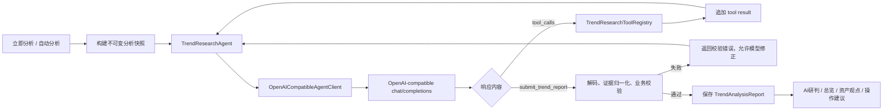

# 内嵌式趋势研究 Agent 技术设计

日期：2026-07-24  
项目：qieman-manager-dashboard  
状态：待实现  
目标版本：下一个补丁版本

## 文档定位

本文档用于指导实现一个纯 Swift、运行在 App 进程内的简易趋势研究 Agent。

本文档取代 `docs/superpowers/specs/2026-06-24-agent-trend-analysis-design.md` 中“检测并启动 Claude CLI、Codex CLI、OpenClaw、Hermes 或自定义本机命令”的方案，也取代当前 `TrendAIClient` 单次请求直接生成整份报告的执行方式。

实现者必须以本文档为准，不得把三种方案叠加：

1. 不再启动任何本机 Agent CLI。
2. 不再使用 `Process`、临时运行目录或 Agent Skill 数据包。
3. 不再以一次 `chat/completions` 请求的自由文本作为最终报告。
4. 保留 OpenAI-compatible `chat/completions` 作为模型传输协议，在 App 内实现消息循环、只读工具、参数校验、报告提交和自动纠错。

## 背景与当前问题

当前趋势分析链路是：

```text
AppModel
  → TrendAnalysisContextBuilder
  → TrendPromptBuilder
  → TrendAIClient
  → POST {baseURL}/chat/completions
  → 从 content 提取 JSON
  → TrendAnalysisValidator
  → 保存 TrendAnalysisReport
```

这条链路存在以下问题：

1. 模型必须在一次响应中同时理解所有组合数据、完成市场和板块分析、覆盖所有持有基金、生成行动候选并输出完整 JSON，失败面太大。
2. 请求没有 `tools`、`tool_calls` 或真正的外部数据工具；“支持联网”目前只是提示词开关，不能保证模型真的取得了可核验的信息。
3. JSON 结构主要依赖提示词约束。模型漏字段、输出截断或夹带文本后，只能整次失败，不能根据具体错误继续修正。
4. 大组合依赖 `TrendAnalysisChunker` 做多次分块和最终合成，模型请求次数多，分块结论也可能互相矛盾。
5. 模型提供的 evidence 只做浅层结构校验，无法证明来源确实来自本次 App 数据。
6. `generatedAt` 和 `dataAsOf` 当前都被覆盖成执行时间，混淆了“报告生成时间”和“底层数据截止时间”。
7. 仓库仍保留一套已经断开生产入口的本机 Agent Detector、Runner、Process 和 Workspace，增加维护成本并容易误导后续开发。

## 参考设计

方案参考 Pi Agent Core 的核心循环，而不是引入 Pi 的 TypeScript 代码或运行时：

- Agent 自己维护消息状态。
- 模型调用只发生在统一传输边界。
- 模型返回 tool call 后，运行时校验参数并执行工具。
- 工具结果作为 tool message 回灌给模型。
- 模型可以在下一轮继续调用工具或提交最终结果。
- 工具错误不会立即终止整次任务，而是返回模型进行修正。
- Agent 运行过程通过事件流向 UI 报告。
- 运行时有轮次、工具次数、超时、取消和上下文体积边界。

参考：

- <https://github.com/earendil-works/pi/blob/main/packages/agent/src/agent-loop.ts>
- <https://github.com/earendil-works/pi/blob/main/packages/agent/README.md>

本项目只采用上述最小思想，不实现通用编码 Agent、扩展系统、子 Agent、多会话分支、shell 工具或任意文件工具。

## 目标

- 在 App 进程内实现一个纯 Swift 趋势研究 Agent。
- 不依赖本机安装的 Claude、Codex、OpenClaw、Hermes、Node 或其他可执行程序。
- 继续兼容支持原生 tool calling 的 OpenAI-compatible `chat/completions` 服务。
- 使用只读领域工具逐步读取组合、持仓、平台信号和市场快照。
- 通过专用 `submit_trend_report` 工具提交最终报告。
- 报告校验失败时把具体错误返回模型，允许有限次数自动修正。
- 保证一次运行期间的数据一致，不因后台刷新导致不同轮次读取到不同状态。
- 保留现有 `TrendAnalysisReport`、趋势 UI、总览摘要、资产 AI 观点、AI 操作建议和跟踪清单。
- 删除已经失效的本机 Agent 执行框架和 App Bundle 中的 Agent Skill 资源。

## 非目标

- 不实现自由聊天界面。
- 不允许 Agent 修改持仓、计划、待确认交易或跟踪清单。
- 不允许 Agent 自动交易。
- 不提供 shell、文件读写、任意 URL 请求或任意命令执行工具。
- 第一版不实现通用网页搜索。
- 第一版不实现多模型评审、多个 Agent 辩论或子 Agent。
- 第一版不实现工具并发；工具按返回顺序串行执行。
- 第一版不保存跨任务的模型会话。
- 不引入第三方 Swift Agent SDK 或 JSON Schema 运行时依赖。

## 总体架构



核心边界：

```text
AppModel
  ├── 负责刷新数据、生成快照、更新 UI 状态、保存最终报告
  └── 不负责逐轮拼消息和执行工具

TrendResearchAgent
  ├── 负责模型轮次、工具调用、错误回灌、终止条件
  └── 不直接读取 AppModel、Store 或网络客户端

TrendResearchToolRegistry
  ├── 只读取本次 TrendResearchSnapshot
  └── 不允许写入用户数据

OpenAICompatibleAgentClient
  ├── 只负责 chat/completions 请求与响应协议
  └── 不包含趋势分析业务规则
```

## 建议目录结构

新增：

```text
macos-app/Core/TrendResearch/
├── OpenAICompatibleAgentClient.swift
├── TrendResearchAgent.swift
├── TrendResearchAgentModels.swift
├── TrendResearchSnapshot.swift
├── TrendResearchTool.swift
├── TrendResearchToolRegistry.swift
└── TrendResearchPromptBuilder.swift
```

如果单文件过长，可以把工具实现拆为：

```text
macos-app/Core/TrendResearch/Tools/
├── PortfolioOverviewTool.swift
├── PortfolioAssetsTool.swift
├── PlatformSignalsTool.swift
├── MarketSnapshotTool.swift
└── SubmitTrendReportTool.swift
```

不要创建通用框架目录，不要为未来假设提前增加插件发现、动态加载或脚本执行能力。

## 一次运行的数据快照

### 原则

Agent 运行前，由 `@MainActor AppModel` 把当前状态转换成一个不可变、`Sendable` 的 `TrendResearchSnapshot`。后续所有工具只查询该快照，不直接访问 `AppModel`。

这样可以保证：

- 多轮模型调用读到同一份持仓和行情。
- 后台自动刷新不会改变本次分析依据。
- 工具可以脱离 `@MainActor` 执行。
- 隐私过滤在进入 Agent 前一次完成。
- 测试可以直接构造快照，不需要启动完整 AppModel。

### 建议模型

```swift
struct TrendResearchSnapshot: Sendable, Hashable {
    let runID: UUID
    let createdAt: String
    let dataAsOf: String
    let privacyMode: TrendPrivacyMode
    let portfolio: TrendContextPortfolio
    let assets: [TrendContextAsset]
    let sectors: [TrendContextSector]
    let platformSignals: [TrendResearchSignal]
    let managerSignals: [TrendResearchSignal]
    let marketQuotes: [TrendResearchQuote]
    let insightHeadline: String
    let sourceWarnings: [String]
}
```

`TrendResearchSignal` 和 `TrendResearchQuote` 必须包含稳定 ID 与来源时间，供证据校验使用。

### 隐私

继续保留两种模式：

- `脱敏摘要`
  - 不包含市值、成本、收益金额、待确认金额、计划金额。
  - 可以包含基金名称、代码、仓位比例、收益率、估值涨跌、计划数量和待确认数量。
- `完整明细`
  - 可以包含现有完整金额字段。
  - 仍由用户显式选择。

工具层不能持有原始 `PersonalAssetAggregateRow` 或 AppModel 引用，否则脱敏工具可能绕过快照读取完整金额。

### 时间语义

- `generatedAt`：App 接受最终报告的时间。
- `dataAsOf`：快照中用于分析的数据截止时间。
- 模型返回的这两个字段不可信，最终由 App 覆盖。

`TrendResearchSnapshot` 应保存各来源时间，并采用保守规则计算 `dataAsOf`。如果无法确定精确时间，使用快照创建时间，同时在 `sourceWarnings` 中明确“部分底层来源未提供精确截止时间”，不要伪造历史时间。

## OpenAI-compatible 传输层

### 职责

将当前趋势专用 `TrendAIClient` 改造成不含领域逻辑的 `OpenAICompatibleAgentClient`。

请求仍为：

```http
POST {baseURL}/chat/completions
Authorization: Bearer {apiKey}
Content-Type: application/json
```

请求体需要支持：

```json
{
  "model": "glm-5.2",
  "messages": [],
  "tools": [],
  "tool_choice": "auto",
  "temperature": 0.2
}
```

第一版不要求流式响应。

### 消息类型

```swift
enum AgentChatRole: String, Codable {
    case system
    case user
    case assistant
    case tool
}

struct AgentChatMessage: Codable, Hashable, Sendable {
    let role: AgentChatRole
    let content: String?
    let toolCalls: [AgentToolCall]?
    let toolCallID: String?
}

struct AgentToolCall: Codable, Hashable, Sendable {
    let id: String
    let type: String
    let function: AgentToolFunctionCall
}

struct AgentToolFunctionCall: Codable, Hashable, Sendable {
    let name: String
    let arguments: String
}
```

CodingKeys 必须映射 OpenAI-compatible 字段：

- `tool_calls`
- `tool_call_id`

模型返回 tool call 时，即使 `content` 是 `null` 也属于合法响应。不能沿用当前“content 为空即失败”的判断。

### 工具消息顺序

每轮必须按协议追加：

1. 完整 assistant message，包含原始 `tool_calls`。
2. 每个 tool call 对应一条 `role=tool` 消息。
3. tool message 必须带相同 `tool_call_id`。
4. 所有工具结果追加后才能发送下一轮模型请求。

禁止只把工具结果拼成普通 user 文本。

### Provider 能力检测

设置页的“检测模型”必须改为真实工具调用探测：

1. 注册一个无副作用的 `agent_capability_probe` 工具。
2. 明确要求模型调用该工具。
3. 优先使用指定函数的 `tool_choice`；供应商不接受时可以退回 `auto` 再探测一次。
4. 只有响应中包含合法 `tool_calls` 才视为支持内嵌 Agent。
5. 只返回普通文本的服务视为“不支持工具调用”，禁止开始趋势 Agent。

新增运行时结果：

```swift
struct TrendProviderCapabilities: Hashable, Sendable {
    let supportsToolCalls: Bool
    let supportsForcedToolChoice: Bool
    let checkedAt: String
    let detail: String
}
```

不需要持久化供应商版本特性；可以保留最近一次检测结果用于当前 App 会话显示。

删除设置页中的“支持联网/外部信号”人工开关。是否有外部信号只能由 App 实际提供的工具和证据账本决定。

## 工具协议

### 工具接口

```swift
protocol TrendResearchTool: Sendable {
    var name: String { get }
    var description: String { get }
    var parameters: AgentJSONValue { get }

    func execute(
        argumentsJSON: String,
        context: TrendResearchToolContext
    ) async -> TrendResearchToolResult
}
```

`parameters` 是发送给模型的 JSON Schema。不要引入通用 JSON Schema 依赖；每个工具使用自己的 Codable 参数类型完成运行时校验。

```swift
struct TrendResearchToolContext: Sendable {
    let snapshot: TrendResearchSnapshot
    let evidenceLedger: TrendEvidenceLedger
}

struct TrendResearchToolResult: Sendable {
    let contentJSON: String
    let isError: Bool
    let completion: TrendResearchCompletion?
}

enum TrendResearchCompletion: Sendable {
    case report(TrendAnalysisReport)
}
```

### 统一结果信封

普通工具成功：

```json
{
  "ok": true,
  "data": {},
  "warnings": [],
  "evidence_ids": ["portfolio:overview:2026-07-24"]
}
```

普通工具失败：

```json
{
  "ok": false,
  "error": {
    "code": "invalid_arguments",
    "message": "limit 必须在 1...20 之间"
  }
}
```

参数错误、未知工具和数据不可用都应作为 tool result 返回模型；只有网络失败、取消、总超时和内部不变量破坏才终止整个 Agent。

## 第一版工具集

### `get_portfolio_overview`

用途：取得组合基线。

参数：空对象。

返回：

- 持仓数量。
- 计划数量。
- 待确认交易数量。
- 板块暴露。
- 集中度摘要。
- 隐私模式。
- 本地洞察标题。
- 数据截止时间与来源警告。

Agent 在提交报告前必须至少调用一次。

### `get_portfolio_assets`

用途：分页读取资产明细，替代 `TrendAnalysisChunker`。

参数：

```json
{
  "cursor": 0,
  "limit": 20,
  "codes": ["000001"]
}
```

规则：

- `cursor` 默认 0，不能为负数。
- `limit` 默认 20，范围 1...20。
- `codes` 可选；提供后只返回匹配资产。
- 返回 `next_cursor` 和 `has_more`。
- 按快照中的既定顺序返回，不能每页重新排序。
- 每个资产返回稳定 evidence ID。

Agent 必须读取完所有页面，或者通过 `codes` 覆盖全部持有基金。最终 Validator 仍以快照中的基金代码检查 `assetTrends` 覆盖率。

### `get_platform_signals`

用途：读取且慢平台、alfa 投顾和主理人关注信号。

参数：

```json
{
  "limit": 20,
  "sources": ["qieman", "alfa", "manager"]
}
```

规则：

- `limit` 范围 1...20。
- 来源只能使用已知枚举。
- 返回发生时间、标的、动作、来源、估值变化和稳定 evidence ID。
- 没有信号返回空数组，不视为错误。

### `get_market_snapshot`

用途：读取 App 已获取的大盘、基金估值和行情快照。

参数：

```json
{
  "asset_codes": ["000001"],
  "include_indices": true
}
```

规则：

- 只返回快照已有数据，不在工具内部任意访问互联网。
- 缺失数据必须显式列入 warnings。
- 不允许把陈旧净值表达成实时行情。

### `submit_trend_report`

用途：提交最终报告并终止 Agent。

参数 Schema 只要求 `report` 是对象，不在工具 Schema 中复制整份 `TrendAnalysisReport` 结构：

```json
{
  "type": "object",
  "properties": {
    "report": {
      "type": "object"
    }
  },
  "required": ["report"],
  "additionalProperties": false
}
```

运行步骤：

1. 取出 `report` 对象并重新编码为 Data。
2. 用 `JSONDecoder` 解码 `TrendAnalysisReport`。
3. 用本次快照覆盖 `privacyMode` 和 `dataAsOf`。
4. 用当前时间覆盖 `generatedAt`。
5. 归一化证据。
6. 调用增强后的 `TrendAnalysisValidator`。
7. 验证通过则返回 `.report(report)`，Agent 立即结束。
8. 验证失败则返回 `ok=false` 和详细 errors，Agent 继续修正。

提交失败结果示例：

```json
{
  "ok": false,
  "error": {
    "code": "report_validation_failed",
    "message": "报告未通过校验"
  },
  "errors": [
    "缺少基金 000001 的 assetTrends",
    "short 缺少 counterSignals",
    "evidence id external:99 不存在"
  ],
  "remaining_repair_attempts": 1
}
```

同一次运行最多允许两次无效提交。第三次无效提交终止运行并保留上一次成功报告。

## 证据账本

每个读取工具返回的数据都必须同时登记为 App 生成的 `TrendEvidence`：

```swift
actor TrendEvidenceLedger {
    func record(_ evidence: [TrendEvidence])
    func evidence(for id: String) -> TrendEvidence?
    func allIDs() -> Set<String>
}
```

建议 ID：

```text
portfolio:overview:<snapshot-id>
portfolio:asset:<asset-key>
platform:<source>:<action-id>
manager:<event-id>
market:<kind>:<quote-time>
```

`submit_trend_report` 必须执行：

1. `report.evidence` 中的每个 ID 都必须存在于账本。
2. `marketOutlook`、`sectors` 和 `opportunities` 中的每个 `evidenceIDs` 都必须存在于最终 `report.evidence`。
3. 对合法 ID，忽略模型填写的 `sourceName`、`title`、`url`、`publishedAt`、`retrievedAt` 和 `summary`，用账本中的规范对象覆盖。
4. 未被引用的 evidence 可以从最终报告删除，控制报告体积。
5. 模型不得创造 URL 或来源标题。

第一版没有 App 自有新闻搜索工具，因此：

- 只有本地组合事实时使用 `externalSignalStatus=unavailable`。
- 使用了平台、主理人或市场快照但没有独立新闻来源时使用 `partial`。
- 第一版不允许 `available`；Validator 应拒绝。
- 后续只有增加 App 自有的受控新闻工具后，才允许 `available`。

## Agent 消息与运行循环

### 初始消息

system prompt 只包含：

- 角色和非投资建议边界。
- 可用工具及调用顺序。
- 必须通过 `submit_trend_report` 提交。
- 报告字段规则、自然中文规则和禁止强制买卖措辞。
- 证据只能引用工具返回 ID。
- 所有持有基金必须出现在 `assetTrends`。
- 重点资产与组合行动数量约束。

user prompt 只包含：

- 本次研究目标。
- 隐私模式。
- 快照 ID、资产数量和数据截止时间。
- 要求先调用 `get_portfolio_overview`。

不要在初始 user prompt 中再次内嵌整份持仓 JSON。资产数据由工具按需提供。

### 运行策略

```swift
struct TrendResearchRunPolicy: Sendable {
    let maxTurns: Int                 // 8
    let maxToolCalls: Int             // 16
    let maxInvalidSubmissions: Int    // 2
    let maxPlainTextResponses: Int    // 2
    let perRequestTimeoutSeconds: Double // 90
    let totalTimeoutSeconds: Double   // 300
    let maxToolResultBytes: Int       // 32 KiB
}
```

### 伪代码

```swift
func run(snapshot: TrendResearchSnapshot) async throws -> TrendAnalysisReport {
    var messages = promptBuilder.initialMessages(snapshot: snapshot)
    var state = TrendResearchRunState()

    emit(.started)

    while state.turnCount < policy.maxTurns {
        try Task.checkCancellation()
        try totalDeadline.check()

        state.turnCount += 1
        emit(.turnStarted(state.turnCount))

        let response = try await client.complete(
            messages: messages,
            tools: registry.definitions,
            timeout: policy.perRequestTimeoutSeconds
        )

        messages.append(response.assistantMessage)

        if response.stopReason == .length {
            messages.append(userCorrection(
                "上次响应被截断，不得执行不完整工具参数，请重新发出完整 tool call。"
            ))
            continue
        }

        guard !response.toolCalls.isEmpty else {
            state.plainTextResponses += 1
            guard state.plainTextResponses <= policy.maxPlainTextResponses else {
                throw TrendResearchAgentError.missingToolCalls
            }
            messages.append(userCorrection(
                "普通文本不会被接收。请调用只读工具，最后通过 submit_trend_report 提交。"
            ))
            continue
        }

        for call in response.toolCalls {
            guard state.toolCallCount < policy.maxToolCalls else {
                throw TrendResearchAgentError.toolCallLimitExceeded
            }
            state.toolCallCount += 1

            let result = await registry.execute(call, snapshot: snapshot)
            messages.append(toolMessage(callID: call.id, result: result))

            if case .report(let report) = result.completion {
                emit(.completed)
                return report
            }
        }

        compactContextIfNeeded(&messages)
    }

    throw TrendResearchAgentError.turnLimitExceeded
}
```

### 工具调用幂等

- 以 `tool_call_id` 缓存已经执行的结果。
- 同一 ID 再次出现时返回原结果，不重复执行。
- 本项目工具全部只读，但仍保持幂等，避免供应商重试导致日志和 evidence 重复。

### 上下文控制

第一版不做模型摘要式压缩，只做确定性裁剪：

- system 和初始 user 消息永远保留。
- 最终提交失败的最近两轮永远保留。
- 重复调用同一分页工具时，可以把更早的完整工具结果替换为包含 evidence ID 的短摘要。
- 单个工具结果超过 32 KiB 时必须分页或截断并返回 `has_more`，不能直接塞入消息。
- 不允许删除尚未被后续 assistant 消息消费的 tool result。

## 运行事件与 UI

新增：

```swift
enum TrendResearchAgentEvent: Sendable {
    case started(runID: UUID)
    case turnStarted(Int)
    case modelRequestStarted(turn: Int)
    case modelResponseReceived(turn: Int, duration: Double)
    case toolStarted(name: String)
    case toolFinished(name: String, summary: String)
    case reportValidationFailed(errors: [String], remainingAttempts: Int)
    case completed(duration: Double)
    case failed(message: String)
    case cancelled
}
```

AppModel 把事件转换为现有 `TrendProgressLog`，示例：

```text
开始内嵌趋势 Agent
第 1 轮：请求模型
读取组合概览
读取第 1–20 个持仓
读取平台与主理人信号
第 4 轮：提交趋势报告
报告校验失败，自动修正 1/2
报告校验通过
趋势分析完成
```

UI 调整：

- 模型配置仍保留供应商、Base URL、模型、API Key 和超时。
- 删除“支持联网/外部信号”开关。
- “检测模型”展示“模型可用，支持工具调用”或“不支持 Agent 工具调用”。
- 未通过工具调用检测时禁用“立即分析”。
- 生成中允许用户取消。
- 失败时保留最后一份成功报告。
- 进度页不显示完整工具参数、金额或 API Key。

## AppModel 接入

`AppModel` 服务属性调整为：

```swift
var trendResearchAgent: any TrendResearchAgentProtocol =
    TrendResearchAgent(client: OpenAICompatibleAgentClient())
```

`generateTrendAnalysis` 新流程：

1. 检查 Provider 配置和工具调用能力。
2. 把当前状态冻结为 `TrendResearchSnapshot`。
3. 清空本次进度，设置 `.generating`。
4. 调用 `trendResearchAgent.run(snapshot:settings:eventHandler:)`。
5. Agent 返回的报告已经完成解码、证据归一化和 Validator 校验。
6. 更新 `trendReport`、`lastTrendGeneratedAt` 和自动分析时段。
7. 保存报告和设置。
8. 失败或取消时不覆盖旧报告。

删除 `AppModel/TrendAnalysis.swift` 中：

- `generateTrendReport` 的单次和分块分支。
- `requestTrendReport`。
- 模型等待 heartbeat；改用 Agent 事件和请求级耗时。
- 从普通 content 提取 JSON 的依赖。

## 定时分析

本次实现至少应避免当前启动路径的重复调用：

- `AppModel.start()` 和 `ContentView.task` 只能保留一个 `runDailyTrendAnalysisIfNeeded()` 调用点。
- 成功、失败和取消都不能并发启动第二个 Agent。
- 自动分析仍保留现有时段配置和补跑语义。

如果本次不实现常驻计时器，UI 文案必须继续表达为“打开主界面时补跑”。不要宣称 App 关闭时或长期停留前台时一定按点执行。

## 设置与持久化迁移

### 保留

`TrendAIProviderSettings` 保留：

- `providerName`
- `baseURL`
- `model`
- `apiKey`
- `timeoutSeconds`

后续应迁移 API Key 到 Keychain，但不是本次 Agent 改造的阻塞项。

### 删除

删除：

- `TrendAnalysisSettings.agent`
- `TrendAgentSettings`
- `TrendAgentKind`
- `TrendAgentCandidate`
- `supportsOnlineSearch` 的 UI 和运行含义

为了兼容已有设置文件：

- Decoder 应允许旧 JSON 中存在多余的 `agent` 和 `supportsOnlineSearch` 字段。
- 新版本加载旧设置后继续使用 provider 配置。
- 下一次保存时自然重写为新结构。
- 不得清空现有 Base URL、模型或 API Key。

## 删除旧实现

确认新 Agent 测试和 AppModel 接入完成后删除：

```text
macos-app/Core/TrendAgentDetector.swift
macos-app/Core/TrendAgentModels.swift
macos-app/Core/TrendAgentProcess.swift
macos-app/Core/TrendAgentRunners.swift
macos-app/Core/TrendRunWorkspace.swift

macos-app/Tests/QiemanDashboardTests/TrendAgentDetectorTests.swift
macos-app/Tests/QiemanDashboardTests/TrendAgentRunnerTests.swift
macos-app/Tests/QiemanDashboardTests/TrendAgentSettingsTests.swift
macos-app/Tests/QiemanDashboardTests/TrendRunWorkspaceTests.swift
macos-app/Tests/QiemanDashboardTests/TrendSkillPackTests.swift

skills/investment-trend-analysis/
```

在分页资产工具和完整覆盖测试通过后删除：

```text
macos-app/Core/TrendAnalysisChunker.swift
macos-app/Tests/QiemanDashboardTests/TrendAnalysisChunkerTests.swift
```

替换或大幅收缩：

```text
macos-app/Core/TrendAIClient.swift
macos-app/Core/TrendPromptBuilder.swift
macos-app/Core/AppModel/TrendAnalysis.swift
macos-app/Views/SettingsTrendPanel.swift
macos-app/Tests/QiemanDashboardTests/TrendAIClientTests.swift
macos-app/Tests/QiemanDashboardTests/TrendPromptBuilderTests.swift
macos-app/Tests/QiemanDashboardTests/TrendAnalysisAppModelTests.swift
```

更新 `scripts/build_macos_app.sh`：

- 删除“拷贝 Agent 技能资源”步骤。
- 不再把整个 `skills/` 目录复制进 App Bundle。
- 删除 `investment-trend-analysis` 文件完整性校验。
- 删除 `APP_BUNDLE_README.txt` 中“contains native Agent skill resources”说明。

仓库根目录以下外部 Agent 技能继续保留，不参与 App 运行：

```text
skills/qieman-manager-dashboard/
skills/qieman-alpha-signals/
skills/project-map/
```

## Validator 增强

在现有规则基础上增加：

1. 所有持有基金代码必须出现在 `assetTrends`。
2. `report.evidence` 中的 ID 必须来自本次 evidence ledger。
3. 所有 `evidenceIDs` 必须指向 `report.evidence` 中存在的对象。
4. 第一版拒绝 `externalSignalStatus=available`。
5. `privacyMode` 必须与快照一致。
6. `dataAsOf` 和 `generatedAt` 由 App 归一化，不使用模型值。
7. confidence score 必须在 0...100。
8. 行动数量建议不超过 5；超过时可以作为校验错误返回模型精简。
9. evidence 建议不超过 6；超过时可以由 App 按引用去重后裁剪。
10. 继续拒绝“必须买入”“必须卖出”“保证收益”“一定上涨”等绝对措辞。

不要把所有业务规则都写进 JSON Schema；Codable 解码和 `TrendAnalysisValidator` 是最终可信边界。

## 错误处理

需要区分：

- Provider 配置缺失。
- Provider 不支持 tool calling。
- HTTP 错误和限流。
- 单次模型请求超时。
- 整次 Agent 超时。
- 用户取消。
- 模型连续返回普通文本。
- 未知工具。
- 工具参数 JSON 不合法。
- 工具调用次数超限。
- Agent 轮次超限。
- 模型响应被 token limit 截断。
- 报告 Codable 解码失败。
- 报告业务校验失败。
- evidence ID 不合法。

失败原则：

- 不覆盖最后一份成功报告。
- 不保存半成品报告。
- 不把工具错误包装成普通成功数据。
- 不记录 API Key、Authorization header、完整持仓金额或完整模型请求正文。
- 429、余额不足和超时继续复用当前用户可读的错误说明。

## 测试方案

### 传输层

新增 `OpenAICompatibleAgentClientTests`：

1. 请求正确编码 `tools` 和 `tool_choice`。
2. 正确解码 `content=null` 加 `tool_calls`。
3. 正确编码 assistant tool call 和后续 tool result 消息。
4. Provider 返回普通 content 时保持原内容，不误判为工具调用。
5. 处理 401、429、5xx、超时和非法响应。
6. 能力探测只有收到真实 tool call 才成功。

使用自定义 `URLProtocol`，禁止单元测试访问真实模型。

### 工具

新增 `TrendResearchToolTests`：

1. 脱敏快照不返回金额。
2. 完整明细快照保留金额。
3. 资产分页无重复、无遗漏、顺序稳定。
4. 非法 cursor、limit、source 返回结构化错误。
5. 空平台信号返回成功空数组。
6. evidence ledger 记录稳定 ID。
7. 重复 tool call ID 返回同一结果。

### Agent 循环

新增 `TrendResearchAgentTests`，使用脚本化 Fake Client：

1. 模型调用 overview → assets → submit，最终成功。
2. 模型首次返回普通文本，收到纠正后改为调用工具。
3. 模型连续返回普通文本后失败。
4. 模型发出未知工具，收到错误后可以恢复。
5. 模型发送非法参数，收到错误后重试成功。
6. 模型返回 `finish_reason=length` 时不执行截断工具。
7. 首次提交缺基金，收到 Validator 错误后补齐并成功。
8. 第三次无效提交后失败。
9. 超过轮次或工具次数后失败。
10. 用户取消后停止，不保存报告。
11. 整次超时后停止。

### 证据与报告

扩展 `TrendAnalysisValidatorTests`：

1. 模型创造不存在的 evidence ID 时拒绝。
2. evidence 内容被账本规范对象覆盖。
3. `evidenceIDs` 指向未包含证据时拒绝。
4. 第一版返回 `externalSignalStatus=available` 时拒绝。
5. `generatedAt`、`dataAsOf` 和 `privacyMode` 被 App 正确归一化。
6. 所有持有基金覆盖规则保持有效。

### AppModel 与 UI

更新 `TrendAnalysisAppModelTests`：

1. 成功运行后保存报告与自动分析时段。
2. 失败和取消保留旧报告。
3. 同一时间只能有一个 Agent 运行。
4. 自动分析启动入口只调用一次。
5. Provider 不支持工具调用时禁止运行。
6. 进度事件正确转换为 `TrendProgressLog`。

更新源码断言测试，移除对本机 Agent CLI 和 Skill Pack 的旧断言。

## 实施顺序

### 阶段一：传输协议

1. 新增 Agent chat message、tool definition、tool call 和 tool result 模型。
2. 实现 `OpenAICompatibleAgentClient`。
3. 实现真实工具调用能力探测。
4. 完成传输层单元测试。

此阶段不修改生产趋势入口。

### 阶段二：快照和工具

1. 新增 `TrendResearchSnapshot`。
2. 从现有 ContextBuilder 复用隐私过滤和资产聚合逻辑。
3. 实现四个读取工具和 `submit_trend_report`。
4. 实现 evidence ledger 与报告证据归一化。
5. 完成工具和 Validator 测试。

### 阶段三：Agent 循环

1. 实现 `TrendResearchAgent`。
2. 实现轮次、工具数、修正次数、超时和取消。
3. 实现确定性上下文裁剪。
4. 实现事件回调。
5. 完成 Fake Client 驱动的 Agent 测试。

### 阶段四：生产接入

1. AppModel 改用 `TrendResearchAgent`。
2. 设置页接入工具能力检测。
3. 进度 UI 展示工具和自动修正过程。
4. 删除当前单次/分块生成路径。
5. 保留报告展示、操作建议和跟踪清单。
6. 完成 AppModel 和 UI 测试。

### 阶段五：清理

1. 删除本机 Agent Detector、Runner、Process、Workspace。
2. 删除旧测试和 `investment-trend-analysis` Skill。
3. 删除 App Bundle Skill 打包步骤。
4. 删除 `TrendAnalysisChunker`。
5. 清理设置兼容字段和无引用代码。
6. 使用 `rg` 确认生产代码不再引用 Claude、Codex、OpenClaw、Hermes、本机 Agent 或趋势 run packet。

### 阶段六：验证

依次执行：

```bash
cd macos-app
swift test
cd ..
APP_VERSION=<next-version> bash scripts/build_macos_app.sh
```

使用真实已配置 Provider 手工验证：

1. 工具能力检测。
2. 脱敏模式分析。
3. 完整明细模式分析。
4. 大于 20 个持仓的分页读取。
5. 首次报告不完整时自动修正。
6. 用户取消。
7. 失败后旧报告仍然可见。

## 验收标准

全部满足才算完成：

1. App 不依赖任何本机 Agent 可执行程序。
2. 趋势分析生产链路不使用 `Process`。
3. 仓库中旧的趋势 Agent Detector、Runner、Workspace 和 Skill Pack 已删除。
4. App Bundle 不再包含 Agent Skill 资源。
5. 模型必须通过原生 `tool_calls` 读取数据和提交报告。
6. 不支持 tool calling 的 Provider 无法启动趋势 Agent，并显示明确原因。
7. 工具只能读取不可变快照，不能修改用户数据。
8. 脱敏模式不会通过任何工具泄露金额。
9. 报告必须通过 `submit_trend_report` 提交，普通文本不能被保存为报告。
10. 报告失败可以自动修正，超过次数后安全失败。
11. 模型不能伪造 evidence ID、URL 或来源内容。
12. 所有持有基金继续被 `assetTrends` 覆盖。
13. `generatedAt` 和 `dataAsOf` 语义正确。
14. 用户取消、超时、限流或模型错误不会覆盖旧报告。
15. `swift test` 全绿，macOS App 构建成功。

## 实现限制

实现者不得：

- 引入 Node、Python、本地 HTTP 服务或第三方 Agent 进程。
- 保留旧 Agent 框架作为“备用路径”。
- 在 tool calling 不可用时静默回退到一次性自由文本生成。
- 为了让测试通过而降低现有报告 Validator 的基金覆盖或安全措辞要求。
- 给 Agent 提供 shell、任意文件、任意 URL、持仓写入或交易工具。
- 将 API Key、Authorization header、完整工具参数或完整持仓金额写入日志。
- 修改与本次 Agent 改造无关的论坛、平台、alfa、CLI 或自动更新逻辑。

如果实现过程中发现 Provider 的 tool calling 契约与 OpenAI-compatible 格式不一致，应先把差异隔离在 `OpenAICompatibleAgentClient`，不得把供应商特判扩散到 Agent、工具或 AppModel。
